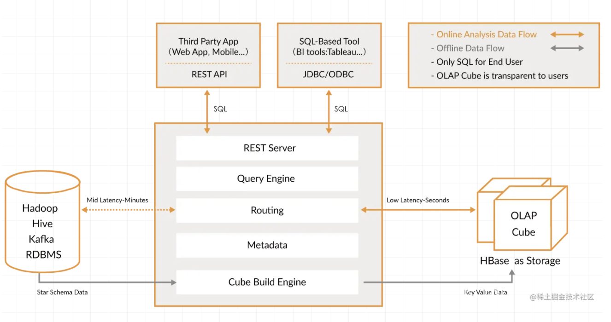

# kylin初体验

从去年12月开始，为了提高公司OLAP系统的查询速度，开始接触kylin，前前后后折腾了近三个月。踩了无数的坑，才算是初窥门径。特在此把自己的感悟、理解记录下来，算是重新梳理一边自己的所得，也希望能给众位正在使用kylin或者打算使用kylin的小伙伴们提供一点帮助😊

### 一句话的概括（我的理解）

kylin将OLAP分析的星型模型schema的所有group by聚合结果存储在HBASE的表中，通过将sql查询转化成对hbase表的聚合操作的方式大大提高查询速度。

<!-- more -->

#### 官方介绍

http://kylin.apache.org/
Apache Kylin™ is an open source Distributed Analytics Engine designed to provide SQL interface and multi-dimensional analysis (OLAP) on Hadoop supporting extremely large datasets, original contributed from eBay Inc.

#### kylin的角色

* 上层应用
  + SQL应用：Zeplin等，通过jdbc/odbc调用kylin
  + 第三方应用：通过kylin的restful接口调用kylin
  + BI应用：Saiku+Mondrian， Tabula
* kylin
  + 提供jdbc/odbc driver以及restful接口，接受sql查询
  + 判断sql该从hbase直接查询，还是该查询原始的hive表
  + 提供cube设计、构建、管理的接口和UI
* 下层基础(kylin 1.2)
  + hadoop 2.4 - hadoop 2.7
  + hive 0.13 - hive 0.14
  + hbase 0.98 - hbase 0.99
  + JDK 1.7+

#### kylin 架构

Kylin 架构：

 - **REST Server**：提供jdbc/odbc接口以及restful接口
 - **Metadata**：存储在hbase中的cube相关信息（project信息、hive table 信息、cube Schema...)
 - **Routing**:处理Rest Server接受到的请求，查询Metadata，判断从hbase取数还是从hive取数
 - **Query Engine**：根据Routing 的判断，执行hbase查询或者hive查询，返回数据给REST Server
 - **Cube Build Engine**：根据metadata中的cube信息，将hive中的数据预计算并写入到hbase

kylin build cube的方法在[官网][1]上有详细的介绍，这里不再赘述

#### 踩过的坑与感悟

1. kylin 的cube 对于用户是透明的。用户无法直接从cube查询。用户需要写维表与事实表的join语句， kylin负责转译成cube的查询。这点也是kylin和中间表、宽表的一大区别。（中间表、宽表在用户端就让sql变得简单， kylin在执行时让sql变得高效）因此，kylin适合与bi引擎对接。中间表、宽表事宜提供给用户。
2. kylin对hadoop生态的版本非常敏感，最好不要超出推荐的版本好范围
3. 搭建kylin时：
   - 需要安装snapy压缩算法，或者将`kylin.hbase.default.compression.codec`配置为其他已有算法
   - 需要将\$HBASE_HOME/conf/hbase-site.xml 中`hbasehbase.zookeeper.quorum`字段的默认端口2181去除掉
   - 需要用huser用户启动kylin
   - 需要保证kylin服务机器与集群中每台机器的hadoop相关环境变量一致
   - kylin执行MR任务时如果报错hcatalog class not found.
     build cube时集群中每台机器都有一些hive的jar包(比如hive-hcatalog-core***.jar)，如果没有，需要合并到\$KYLIN_HOME/lib／kylin-jdbc-{version}.jar中。kylin运行时会将这个jar包put到HDFS上。
   - 对kylin的job进行管理时，常常会因为kylin metadata的缓存导致找不到资源id对应的cube、segment，从而产生一个null pointer错误。解决方法：重启kylin清除缓存，或者修改kylin源码，对job操作中可能出现null pointer的地方做相应处理。
   - kylin的官方介绍中，对于出现在hive表但是没有被预处理存储到hbase中的字段的查询，kylin可以直接查询hive。经过在kylin UI中试验，发现kylin并不能找到hive表，会报找不到字段的错误。
   - kylin对绝大多数SQL语句都有很好的支持，下面列出经过测试kylin不能很好支持的sql语句：

        > - limit 后面添加一个起始位置，一个数据长度，比如limit 1， 20
        > - right outer join
        > - left outer join
        > - select 不在group by 中的字段
        > - count(distinct)
        > - insert, update, delete
        > - union, union all
        > - where exists

[1]: http://kylin.apache.org/docs/tutorial/create_cube.html
