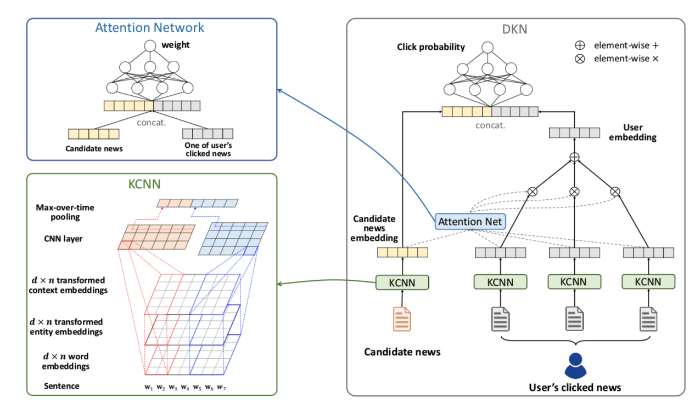

[论文链接](https://arxiv.org/abs/1801.08284)

  - 目标：将知识图谱应用到新闻推荐中
  - input：用户的历史点击的新闻title+候选新闻title+通用知识图谱
  - output：ranking of candidate news
  - 总体架构：
    - 
    - Knowledge distillation
        - 用实体链接技术，将文本中出现的实体，链接到KG中的entity
        - knowledge graph Embedding：translation-based knowledge graph embedding methods （Knowledge Graph Embedding via Dynamic Mapping Matrix）
    - KCNN（knowledge-aware CNN）
        - 用linear mapping方法，将wordEmbedding, entityEmbedding, entityContextEmbedding 映射到相同的维度，作为输入句子的三个channel
        - 用TextCNN将输入句子encode成一个vec
    - Attention-based User Interest Extraction
        - user点击过的所有text的embedding列表作为user的特征
        - 用候选text的embedding对user点击过的text的embedding列表做attention得到最后的特征向量
        - 最后接一个sigmoid，做点击率预估
<!--more-->
- 疑问：
    - 依赖用户的历史点击新闻，不能解决冷启动的问题？
    - graph embedding是基于全图做，还是基于text中提及的entity构成的图做？
    - 如何基于通用KG，做基于entity的预训练？
- 启发：
    - 如果用CNN的方式，不同渠道来的特征，可以对齐之后当做不同channel的数据来用
    - Attention的妙用，在recommend领域（只要是衡量item和list的关系，都可以用）
