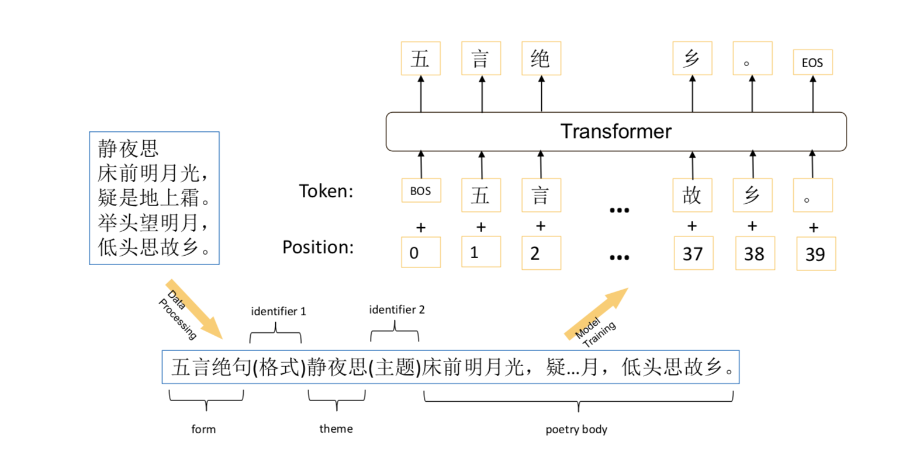

[论文链接](https://arxiv.org/pdf/1907.00151.pdf)

- 目标：根据输入的格式（对联、绝句、律诗、词牌名） + 主体（诗名、词名、藏头诗的头），生成相应格式的对联、诗、词
- 诗歌生成的难点：
    - 生成文本需要满足相应的诗歌类型的格式（长度、对偶、押韵、平仄等）
    - 生成的文本需要主题一致，如果给定主题的话，需要和给定主题一样
- 之前的做法：
    - 用基于constraint 或者基于template的方式满足格式
    - 用插入关键词的方式满足主题一致
    - 需要引入比较多的人工规则和特征
<!--more-->
- 本文的做法：
    - 基于GPT的生成模型
    - 在中文新闻的预料上预训练
    - 在诗词预料上finetune。 输入格式为
    - 
    - 藏头诗用藏头诗的头代替主题词， 对联用上联替代主体词
    - 在诗歌预料训练时间比较短，如果overfit，倾向于输出原句
    - 用topK sampling的方式保证生成结果的diversity（每个字的输出对topK的词做sampling，选择一个）
- 结论：
    - 出人意料的，只用一个简单的GPT模型，输出的结果基本都能满足格式要求（训练预料都是严格满足格式要求的，而GPT能捕捉这种规律）
    - 在给定词牌名生成词的情况下，满足格式的表现差一些（词牌名对应的样本比较少，远远少于绝句、律诗）
- 启发：
    - GPT是一个很强大的生成式模型，而BERT一般只用来做特征提取器，两者区别还是比较大的。 后续要仔细再读一下GPT 以及 GPT2的论文
    - 可以把诗人的名字也加入到输入中，这样可以看看同样的主题、同样的格式，不同的诗人会生成怎样风格不同的诗？
    - 对于BERT/GPT这些基于语言模型的预训练模型来说，输入直接用自然语言的形式比较好。 比如（“律诗”，“绝句”）直接是自然语言拼接到输入中，而不是用两个特征embedding concat到输入上
