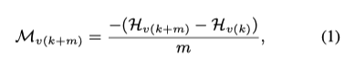
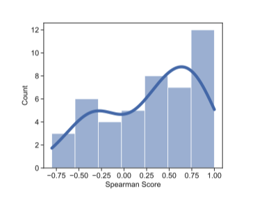

[论文链接](https://arxiv.org/abs/2012.15671)

## 解决的问题
在机器翻译的任务中，合理选择词表和词表的大小至关重要。论文基于Marginal Utility（边际效益）这一经济学概念，提出通过最大化的Marginal Utiltiy of Vocabularization（下文简称MUV）的方式来优化下游任务。关于优化MUV的方法，又有搜索求解和VOLT（转化为Optimal Transport问题）两种方式，后者在效果接近的前提下大大节省计算量，更加低碳

<!--more-->
### MUV
- 词表大**V**对于下游任务的影响：**V**越大，预料的熵越低。但是**V**越大预测的时候就越难，数据稀疏，造成模型难以学习
- 
- MUV和下游任务的BLEU指标关系：
- 
- 上图可以看到MUV和BLEU的[Spearman](https://www.statstutor.ac.uk/resources/uploaded/spearmans.pdf)系数平均值是0.4。可以认定为是正相关的，从而优化MUV是优化BLEU的一种可行方案

## 优化MUV的方法

- MUV-search and Learning
- 前者是一种基于搜索尝试的方法，复杂度过高
- VOLT(VOcabulary Learning approach via optimal Transport) 是一种Learning方法
- MUV可以理解为预料在Vocab上的熵对于Vocab大小**V**的导数（在离散情况下）**注意** 前文分析MUV和BLEU正相关，并不是Entropy和BLUE正相关，所以我们要求MUV的最大值，而不是MUV为0的情况（这个和边际效益的应用有些不太一样）
- 方法大致是将V的上限固定在***S***={k,2k,3k,....}的一个超参数k决定的有限集合内
- 对于**S**中每个固定的**V**上限，将问题转化为char to token 的[Optimal Transport](https://zhuanlan.zhihu.com/p/82424946)问题，用[Sinkhorn算法](https://en.wikipedia.org/wiki/Sinkhorn%27s_theorem)求解出MUV的同时构建出最优的Vocab
- 再在整个**S**上找出最优的MUV和相应的Vocab

## 实验
- 用相对更小的Vocab size 获得近似甚至更好的BLEU值
- 在语料系数的数据集上获得更优的结果
- 除了Transformer结构的，在其他结构的模型里也取得很好的结果

## 总结
- ACL2021最佳论文
- 一个比较通用的方法，能够没有太大代价的应用在所有NLP任务上。计算一个较小且效果好的Vocab
- 切入点很新颖，和Marginal Utiltiy 以及Optimal Transport等问题结合在一起
- 有一些typo和数学推导方面的错误问题，读起来有些困难

## 相关文档
- [知乎上一个不错的详细解读](https://zhuanlan.zhihu.com/p/390978613)
- [paper实现](https://github.com/Jingjing-NLP/VOLT)
