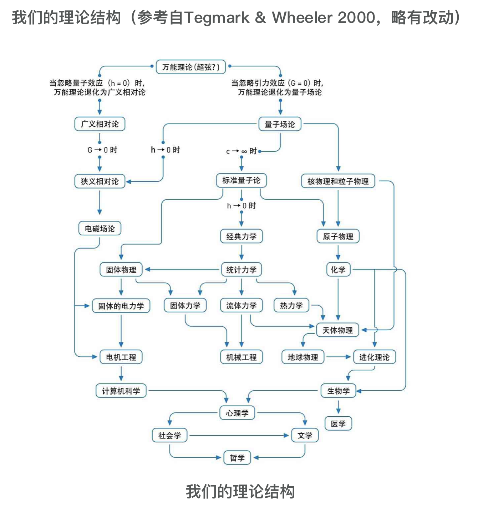

[豆瓣链接](https://book.douban.com/subject/1467022/)

这是一本让人相间恨晚的好书。深动形象地将量子理论的发展脉络展现出来（什么时候我能在自己的专业领域做到这样生动的讲解，那便是一大进步了）。量子理论是理论物理的最前沿，也在实践中发挥出了巨大的作用。本篇读书笔记摘抄一些原文并附上一些自己粗浅的理解（极有可能是错误的，毕竟波尔说过“谁认为自己搞懂了量子理论，谁就并不懂量子理论”）。本书值得一刷再刷！

> 1900年12月14日这个日子，这一天就是量子的诞辰

站在20世纪的开头，对整个20世纪的科学发展方向起到了重要的决定作用。

> 之诺悖论：一个人无论如何无法追上一直乌龟。

小学的时候曾经困扰过我。大学学了极限理论之后在数学上证明了只是在一个固定时间之内无法追上。量子论从显示世界无法无限分割的新角度攻破了这个悖论

<!-- more -->

>科学巨人们参与了推动它(量子论)的工作，却最终因为不能接受它惊世骇俗的解释而纷纷站到了保守的一方去

对于第一代的推动者惊世骇俗，对于第二代的科学家可能就没那么惊世骇俗了（在他们学生期间就了解了这个惊世骇俗的理论）。进过许多代科学巨人的推动，巨石最终被推动，并被每个平凡的人们接受。

>在卢瑟福的模型中，原子这个极小的体系和太阳系这个极大的体系之间居然的确存在许多相似之处。两者都有一个核心，这个核心占据着微不足道的体积（相对整个体系来说），却集中了99%以上的质量。人们不禁要联想，难道原子本身是一个“小宇宙”。

> 这种观点被称为“分形宇宙”（FractalUniverse）模型。在它看来，哪怕是一个原子，也包含了整个宇宙的某些信息，是一个宇宙的“全息胚”。所谓一沙一世界。

难道是小宇宙一词的起源？不过这个奇妙的现象确实让人想象有一个终极的定律定义者宏观与微观的一切

> 爱因斯坦只是说，没有一种能量信号的传递能超过光速

相对论加深理解

> 德布罗意是有史以来第一个仅凭借博士论文就直接获取科学最高荣誉——诺贝尔奖的例子

出道即巅峰

> 哥本哈根和哥廷根、慕尼黑一起成为量子力学发展史上的“黄金三角”

20世纪初的科研中心还远不在美国。科技人才的流动性、大师的感召力，能够让科研中心迅速转移。似乎比产业转移更加快。

第五章 part3 作者介绍海森堡发现的矩阵乘法的时候用了乘坐地铁的例子，很形象。给了矩阵乘法一种很形象的现实比喻。作为大师的海森堡没有学过矩阵乘法，波恩学过矩阵乘法却忘了，哈哈。不过海森堡能再次“发明”矩阵乘法，大师风采！

>在高高的石崖顶上，海森堡面对着壮观的日出景象，他脚下碧海潮生，一直延伸到无穷无尽的远方。是的，他知道，这是属于自己的时刻，他已经做出了生命中最重要的突破，而物理学的黎明也终于到来

>你怎么能‘看到一个小球的位置呢？总得有某个光子从光源出发，撞到这个球身上，然后反弹到你的眼睛里吧？关键是，一个经典小球是个庞然大物，光子撞到它就像蚂蚁撞到大象，对它的影响小得可以忽略不计，绝不会影响它的速度。正因为如此，我们大可以测量了它的位置之后，再从容地测量它的速度，其误差微不足道

测不准原理，实验物理学的一大难题。虽然导致量子力学很多实验难做，但是不影响人们做思维实验，理论推导，再应用到实践中。

>共轭量：精准测试一个变量，另一个变量就变得无法精准获得。 比如时间和能量，位置和速度

> 玻尔的“互补原理”（The Complementary Principle）连同波恩的概率解释，海森堡的不确定性，三者共同构成了量子论“哥本哈根解释”的核心，至今仍然深刻地影响着我们对于整个宇宙的终极认识

> 谈论任何物理量都是没有意义的，除非首先描述你测量这个物理量的方式。一个电子的动量是什么？我不知道，一个电子没有什么绝对的动量，不过假如你告诉我你打算怎么去测量，我倒可以告诉你测量结果会是什么

> 奥卡姆剃刀原理是一个叫威廉的修士提出的。奥卡姆是他出生的地方

> 自海森堡取得突破以来，理论物理进入了前所未有的黄金年代，任何一个二流的学生都可能在其中做出一流的发现
> 虽然量子论的解释依然百家争鸣，没有一个定论，但是不妨碍它成为有史以来实践应用中最成功的物理理论

和编程调包类似，虽然看不懂源码，或者看懂源码不知道为什么这样做。并不妨碍我们调包作出伟大的实践。在实践中的成功又让人们反过来试图解释量子理论而不是质疑量子理论

薛定谔的猫：本来哥本哈根解释只在微观领域，虽然叠加状态很让人费解，但是不影响人们对宏观事物的理解。薛定谔用一个装置巧妙地把这种叠加状态转移到宏观的猫身上，这下大家就得挠破头皮地解释这只猫了😂

> 多宇宙解释：我们的宇宙其实是在多种叠加状态中的，每个确定的“你”生活在这个叠加宇宙的一个投影中。由于维度非常高，两个投影之间的相关度几乎为0。所以不同的宇宙投影可以认为是不相干的平行宇宙。

这个解释是我对量子论所有解释中最认同的一个。同时一些小概率的投影之间相干是否能够用来解释某些灵异事件？

科学的一个特性是能被证伪。严格意义上来说，证伪和证实一样是不可能完成的任务。当出现一个反例，你可以说是测量的问题，可以说是问题定义的问题，甚至创造一个不存在的概念来兼容这个反例，有点类似撒泼打滚。有趣的是，在真正的科学史上，往往还都是这种“撒泼打滚”的情况居多。

> 因此，单凭列举“反面证据”，根本就不可能证伪牛顿理论。事实上，如果仔细考察科学史，我们就会发现，几乎没有任何理论是因为“被证伪”而倒台的，它们退出历史舞台，几乎只有一个理由，就是出现了一个更好、假设更少、更合理的新理论。

量子自杀实验：由于多个平行宇宙，在你有意识的那个宇宙中，你一定没有死，无论连续开枪多少次。你的生死决定了你在哪个宇宙，而不是给定一个宇宙，判定你的生死。

> 换句话说，同样是读入10bits的信息，传统的计算机只能处理1个10位的二进制数，而如果是量子计算机，则可以同时处理210个这样的数！

叠加性让量子计算机可以同时处理所有的可能性。bit数越多，量子计算机的效率优势越明显，而且还是指数级的！

贝尔不等式是判定爱因斯坦支持的决定论和波尔支持的量子论的最终判定条件（因为其可以在现实中做实验），最终波尔取得了最终的胜利。（不知道如果爱因斯坦还在世的话，能想出什么法子“找茬儿”，哈哈）

> 不管是牛顿还是爱因斯坦的理论，都是时间对称的

你可以用这些理论推算历史，逆着时间的河流探索。而现实中，时间只能向前

最新的进展：万能理论（Theory ofEverything, TOE）。统一宇宙中的四种力：：引力、电磁力、强相互作用力和弱相互作用力

万物理论的整体框架

